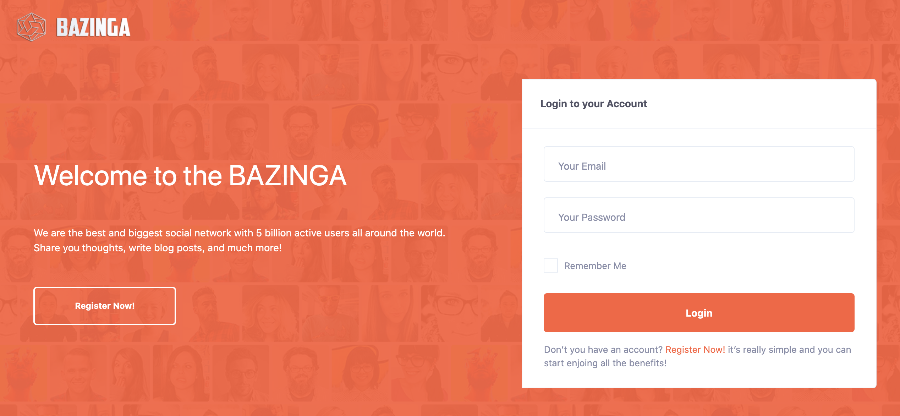
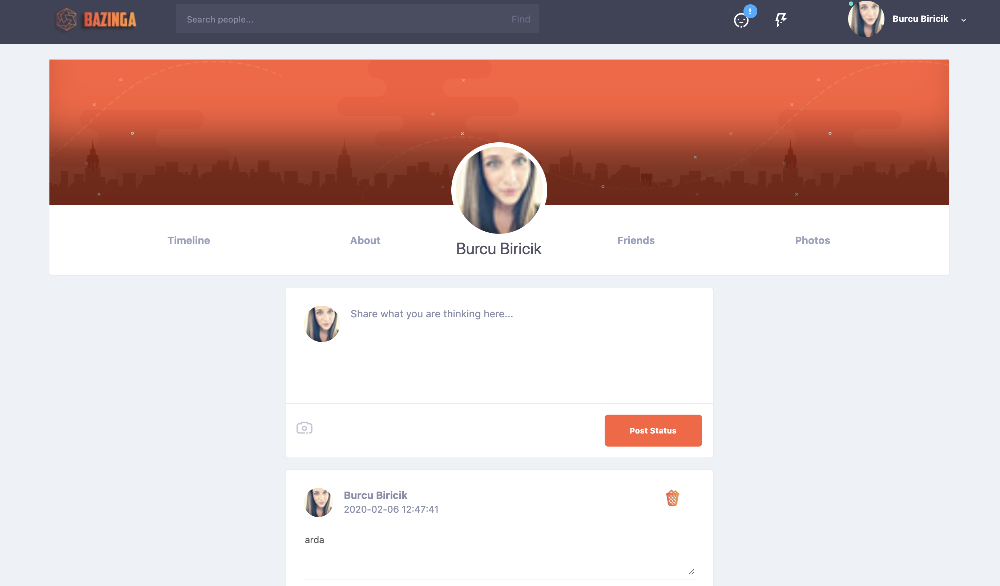
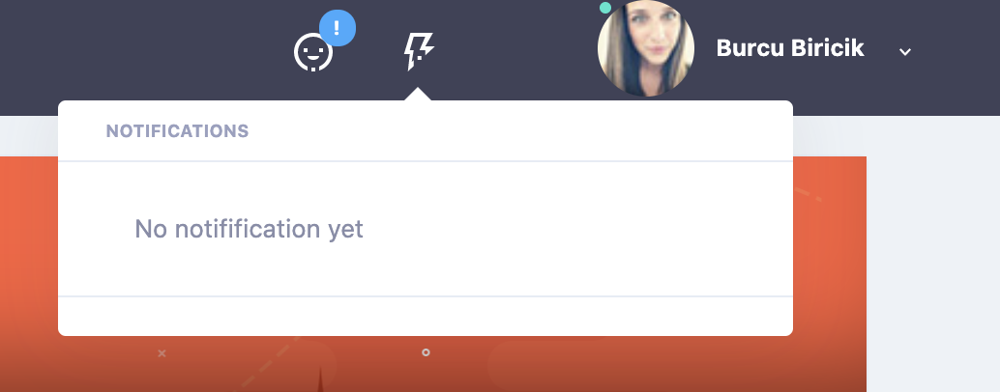
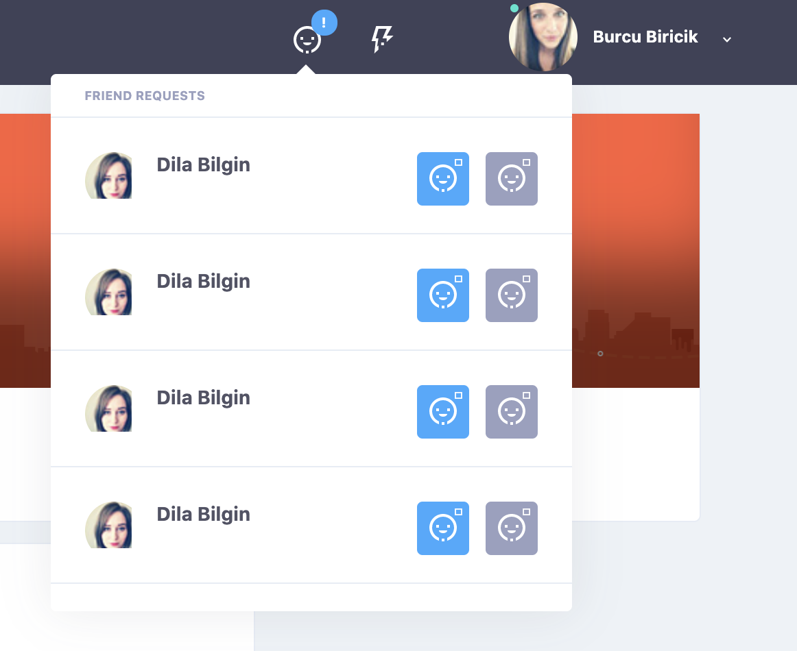
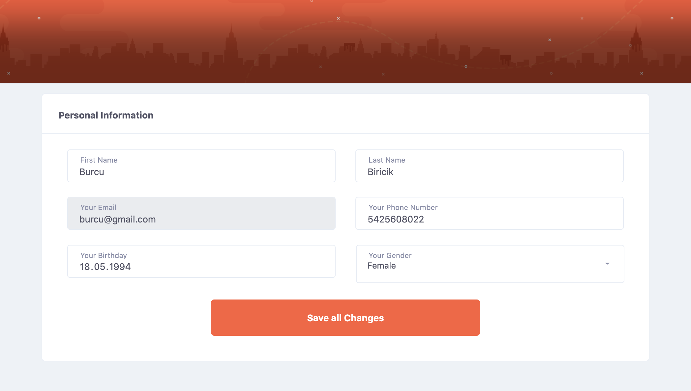

# BAZINGA

It is a social media app for web (dynamic) named as bazinga. You can register as a user and login to the website. Users have the opportunity to follow or unfollow friends, like or dislike friends' posts and reply them. Also they all can share posts including images. 

Used technologies: HTML, CSS, Bootstrap, JavaScript, Php, mySQL.

In order to be execute this project, first you need to import bazingadb file to your local database. Then need to unzip bootstrap and img folders. Lastly open it from your browser using mamp server.

 

